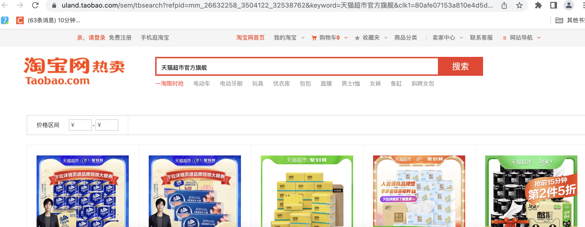
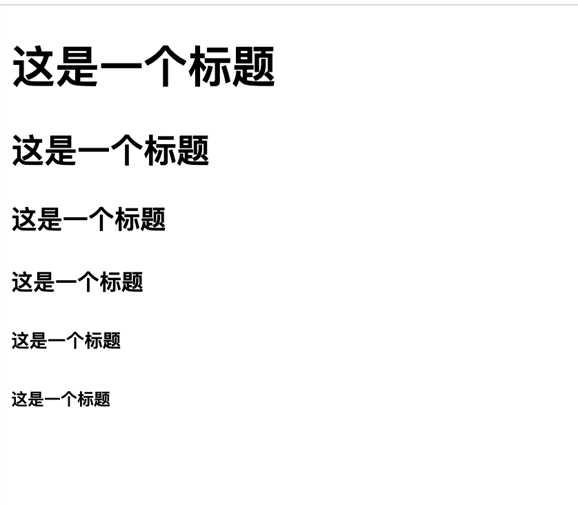

html重修and模版查阅

<!-- more -->

#### HTML简介

HTML全称Hyper Text Markup Language，是超文本标记语言，网页里显示的图片、音频资源等都可以与html文本关联起来，浏览器通过渲染html文本给用户呈现网页；
所谓的超文本，是指文字、图片、音频、视频、动画等资源；
目前HTML版本使用较多的是HTML5，CSS用的较多的是CSS3版本

示例：

页面渲染图片html，或者是封装了html的框架



#### 目录结构

##### html目录结构

```html
<!DOCTYPE html>
<html lang="en">
<head>
    <meta charset="UTF-8">
    <title>Document</title>
</head>
<body>

</body>
</html>
```

- `<!DOCTYPE html>` 声明为 HTML5 文档
- `<html>`元素是 HTML 页面的根元素
- `<head>`元素包含了文档的元（meta）数据，如` <meta charset="utf-8">` 定义网页编码格式为 **utf-8**。
- `<title>` 元素描述了文档的标题
- `<body>`网页主题内容，也就是在浏览器可以看到的内容

#### 标签

##### 标题

h1 到 h6 六级标题有大到小

###### 示例：

```html
<!DOCTYPE html>
<html lang="en">

<head>
    <meta charset="UTF-8">
    <title>Document</title>
</head>

<body>
    <h1>这是一个标题</h1>
    <h2>这是一个标题</h2>
    <h3>这是一个标题</h3>
    <h4>这是一个标题</h4>
    <h5>这是一个标题</h5>
    <h6>这是一个标题</h6>
</body>

</html>
```

###### 页面效果：



##### 段落

###### 示例：

```html
<p>这是一个段落。</p>
```

##### 链接

###### 示例

```html
<a href="https://www.runoob.com">这是一个链接</a>
```

##### 图片

示例

``` html

```
