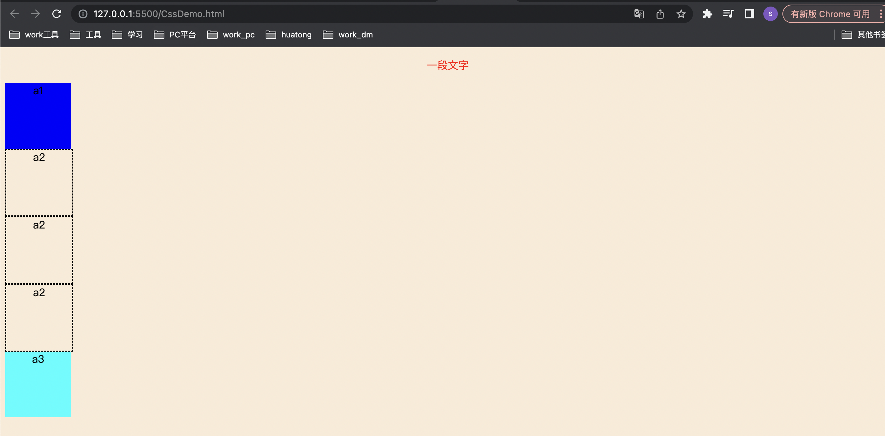

### CSS

#### 一、css简介

##### 1.1什么是css

CSS 是一种描述 HTML 文档样式的语言。

CSS 描述应该如何显示 HTML 元素。

##### 1.2为什么使用css

实现内容与样式的分离，便于团队开发

CSS 用于定义网页的样式，包括针对不同设备和屏幕尺寸的设计和布局。

##### 1.3css语法

```css
<head>
	<style>
		选择器{
			属性名：属性值;
			属性名：属性值;
		}
	</style>
</head>

```

#### 二、css基本使用

##### css位置

###### 外部css

外部样式在 HTML 页面 `head` 部分内的 `link` 元素中进行定义：

```css
<link rel="stylesheet" type="text/css" href="文件地址/文件名.css">
```

###### 内部css

内部样式在 HTML 页面的 `head` 部分内的 `style` 元素中进行定义：

```html
<head>
    <!-- 内部css位置 -->
    <style>
        body {
            background-color: linen;
        }

        h1 {
            color: maroon;
            margin-left: 40px;
        }
    </style>
</head>

<body>

    <h1>This is a heading</h1>
    <p>This is a paragraph.</p>

</body>
```

###### 行内css

行内样式在相关元素的 "style" 属性中定义

```html
<!DOCTYPE html>
<html>
<body>

<h1 style="color:blue;text-align:center;">This is a heading</h1>
<p style="color:red;">This is a paragraph.</p>

</body>
</html>
```

<font color="red">多个`css`文件操作同一个元素生效规则</font>

行内样式（在 HTML 元素中）>外部和内部样式表（在 head 部分）>浏览器默认样式

##### 常用css选择器

```html
<style>
    /* 标签选择器 */
    p {
        /* 居中 */
        text-align: center;
        /* 颜色 */
        color: red;
    }

    /* id选择器 */
    #a1 {
        width: 100px;
        height: 100px;
        background-color: blue;
    }

    /* 类选择器 */
    .a2 {
        width: 100px;
        height: 100px;
        border: dashed;

    }

    /* div标签且class为a3的属性 */
    div.a3 {
        width: 100px;
        height: 100px;
        background-color: aqua;
    }

    /* 通用选择器 ！全局 */
    * {
        background-color: antiquewhite;
    }

    /* 分组选择器 */
    p,
    div {
        text-align: center;
    }
</style>
<body>
    <p>一段文字</p>
    <div id="a1">
        a1
    </div>

    <div class="a2">
        a2
    </div>
    <div class="a2">
        a2
    </div>
    <div class="a2">
        a2
    </div>
    <div class="a3">
        a3
    </div>
</body>
```



##### css注释

```css
/* 这是一条单行注释 */

/* 这是
一条多行的
注释 */ 
```

##### 背景

###### 背景颜色

`background-color`设置背景颜色

```css
 /* 全局背景颜色 */
        * {
            background-color: bisque;
        }
```

**不透明度**

opacity 属性指定元素的不透明度/透明度。取值范围为 0.0 - 1.0。值越低，越透明：

**注意：**使用 `opacity` 属性为元素的背景添加透明度时，其所有子元素都继承相同的透明度。这可能会使完全透明的元素内的文本难以阅读。

```css
<head>
    <style>
        /* 全局背景颜色 */
        * {
            background-color: bisque;
             opacity: 0.3;
        }

        #a1 {
            width: 100px;
            height: 100px;
            background-color: black;
        
        }
    </style>
</head>

<body>
    <div id="a1"></div>
    <div id="a2"></div>
    <div id="a3"></div>
</body>
```

###### 背景图片

`background-image` 属性指定用作元素背景的图像。

`opacity`可以设置背景透明度

```html
<head>
    <style>
        /* 全局背景颜色 */
        * {
            background-image: url("img/d03cf715174d73f774943881c30d9757.jpeg");
        }

    </style>
</head>
<body>
</body>
```

###### 背景重复

背景图片默认重复

`background-repeat`用于设置背景重复方向

| 属性值    | 解释               | 备注                   |
| --------- | ------------------ | ---------------------- |
| repeat-x  | 水平重复           | 建议使用，相对比较美观 |
| repeat-y  | 垂直重复           |                        |
| no-repeat | 只显示一次背景图像 |                        |

###### 背景图像位置

`background-position`

left top用于指定位置

```css
 /* 全局背景颜色 */
        * {
            background-image: url("img/head1.jpeg");
            background-repeat: no-repeat;
             background-position: left top;
        }
```

###### 背景附着

`background-attachment` 属性指定背景图像是应该滚动还是固定的（不会随页面的其余部分一起滚动）

属性值`fixed`背景固定，`scroll`背景随着页面其他部分一起滚动

###### 背景简写

使用简写属性在一条声明中设置背景属性：

在使用简写属性时，属性值的顺序为：

- background-color
- background-image
- background-repeat
- background-attachment
- background-position

属性值之一缺失并不要紧，只要按照此顺序设置其他值即可。请注意，在上面的例子中，我们没有使用 background-attachment 属性，因为它没有值。

##### 边框

`border` 指定元素边框的样式、宽度和颜色。

###### 边框类型

**border-style属性值：**

| 属性值 | 解释                                            |      |
| ------ | ----------------------------------------------- | ---- |
| dotted | 定义点线边框                                    |      |
| dashed | 定义虚线边框                                    |      |
| solid  | 定义实线边框                                    |      |
| double | 定义双边框                                      |      |
| groove | 定义 3D 坡口边框。效果取决于 border-color 值    |      |
| ridge  | 定义 3D 脊线边框。效果取决于 border-color 值    |      |
| inset  | 定义 3D inset 边框。效果取决于 border-color 值  |      |
| outset | 定义 3D outset 边框。效果取决于 border-color 值 |      |
| none   | 定义无边框                                      |      |
| hidden | 定义隐藏边框                                    |      |

```html
<html lang="en">
<head>
    <meta charset="UTF-8">
    <meta name="viewport" content="width=device-width, initial-scale=1.0">
    <title>Document</title>
    <style>
        #a1 {
            border: dotted;
            width: 100px;
            height: 100px;
        }
         #a2 {
            border: dashed;
            width: 100px;
            height: 100px;
        }
         #a3 {
            border: solid;
            width: 100px;
            height: 100px;
        }
         #a4 {
            border: 10px double;
            width: 100px;
            height: 100px;
        }
         #a5 {
            border: 10px groove;
            width: 100px;
            height: 100px;
            background-color: brown;
        }
         #a6 {
            border:10px ridge;
            width: 100px;
            height: 100px;
            background-color:aqua;
        }
         #a7 {
            border:10px inset;
            width: 100px;
            height: 100px;
            background-color: blue;
        }
         #a8 {
            border: outset;
            width: 100px;
            height: 100px;
            background-color: chartreuse;
        }
         #a9 {
            border: none;
            width: 100px;
            height: 100px;
        }
         #a10 {
            border: hidden;
            width: 100px;
            height: 100px;
        }
        /* 混合边框 */
        #a11 {
            border-style:  solid dotted solid ridge;
            width: 300px;
            height: 300px;
        }
    </style>
</head>
<body>
    <div id="a1">
    </div>
    <div id="a2">
    </div>
    <div id="a3">
    </div>
    <div id="a4">
    </div>
    <div id="a5">
    </div>
    <div id="a6">
    </div>
    <div id="a7">
    </div>
    <div id="a8">
    </div>
    <div id="a9">
    </div>
    <div id="a10">
    </div>
    <div id="a11">
    </div>
</body>
</html>
```


**设置单个边框**

```
 border-top-style: dotted;
 border-right-style: solid;
 border-bottom-style: dotted;
 border-left-style: solid;
```

###### 边框宽度

`border-width` 属性指定四个边框的宽度。

```html
<html lang="en">

<head>
    <meta charset="UTF-8">
    <meta name="viewport" content="width=device-width, initial-scale=1.0">
    <title>Document</title>
    <style>
        #a1 {
            width: 500px;
            height: 100px;
            border-style: dashed;
            border-width: 10px;
        }

        /* 具体设置 上右下左 */
        #a2 {
            width: 500px;
            height: 100px;
            border-style: dashed;
            border-width: 10px 1px 5px 20px;
        }
    </style>
</head>
<body>
</body>
<div id="a1">
</div>
<div id="a2">
</div>
</html>
```

###### 边框颜色

`border-color` 属性用于设置四个边框的颜色。

```html
 <style>
        #a1 {
            width: 500px;
            height: 100px;
            border-style: dashed;
            border-width: 10px;
            border-color: blue;
        }

        /* 具体设置 上右下左 */
        #a2 {
            width: 500px;
            height: 100px;
            border-style: dashed;
             border-width: 10px 1px 5px 20px;
            border-color: red blue red blue;
        }
    </style>
```

###### 圆角边框

`border-radius` 属性用于向元素添加圆角边框

```html
 <style>
   /* 10px是设置的弧度大小 */
        #a1 {
            width: 500px;
            height: 100px;
            border: 2px dashed red;
            border-radius: 10px;
        }
  </style>
```

###### 简写

`border` 属性是以下各个边框属性的简写属性：

- `border-width`
- `border-style`（必需）
- `border-color`

```html
<style>
        #a1 {
            width: 500px;
            height: 100px;
            border: 2px dashed red;
        }
 </style>
```

##### 外边距

CSS 拥有用于为元素的每一侧指定外边距的属性：

- `margin-top`
- `margin-right`
- `margin-bottom`
- `margin-left`

简写margin可以

**auto 值**

您可以将 margin 属性设置为 `auto`，以使元素在其容器中水平居中。

**inherit 值**

继承父元素的边距值

##### 内边距

拥有用于为元素的每一侧指定内边距的属性：

- `padding-top`
- `padding-right`
- `padding-bottom`
- `padding-left`

简写Padding

##### 高度跟宽度

`eight` 和 `width` 属性用于设置元素的高度和宽度。

**属性值**

- `auto` - 默认。浏览器计算高度和宽度。
- `*length*` - 以 px、cm 等定义高度/宽度。
- `%` - 以包含块的百分比定义高度/宽度。
- `initial` - 将高度/宽度设置为默认值。
- `inherit` - 从其父值继承高度/宽度。

| **属性**                                                     | **描述**             |
| ------------------------------------------------------------ | -------------------- |
| [height] | 设置元素的高度。     |
| [max-height] | 设置元素的最大高度。 |
| [max-width] | 设置元素的最大宽度。 |
| [min-height] | 设置元素的最小高度。 |
| [min-width] | 设置元素的最小宽度。 |
| [width] | 设置元素的宽度。     |

##### css轮廓

轮廓是在元素周围绘制的一条线，在边框之外，以凸显元素。属性使用跟边框类似

**注意：**<font color = "red">轮廓与[边框]不同！不同之处在于：轮廓是在元素边框之外绘制的，并且可能与其他内容重叠。同样，轮廓也不是元素尺寸的一部分；元素的总宽度和高度不受轮廓线宽度的影响。</font>

###### 轮廓样式`outline-style`

outline-style 属性指定轮廓的样式，并可设置如下值：

- `dotted` - 定义点状的轮廓。
- `dashed` - 定义虚线的轮廓。
- `solid` - 定义实线的轮廓。
- `double` - 定义双线的轮廓。
- `groove` - 定义 3D 凹槽轮廓。
- `ridge` - 定义 3D 凸槽轮廓。
- `inset` - 定义 3D 凹边轮廓。
- `outset` - 定义 3D 凸边轮廓。
- `none` - 定义无轮廓。
- `hidden` - 定义隐藏的轮廓。
```html
<head>
    <meta charset="UTF-8">
    <meta name="viewport" content="width=device-width, initial-scale=1.0">
    <title>Document</title>

    <style>
        #a1 {
            width: 100px;
            height: 100px;
            outline-style: dotted;
        }
        #a2 {
            width: 100px;
            height: 100px;
            outline-style: dashed;
        }
        #a3 {
            width: 100px;
            height: 100px;
            outline-style: solid;
        }
        #a4 {
            width: 100px;
            height: 100px;
            outline-style: double;
        }
         #a5 {
            width: 100px;
            height: 100px;
            outline-style: groove;
        }
        #a6 {
            width: 100px;
            height: 100px;
            outline-style: ridge;
        }
        #a7 {
            width: 100px;
            height: 100px;
            outline-style: inset;
        }
        #a8 {
            width: 100px;
            height: 100px;
            outline-style: outset;
        }
    </style>
</head>
<body>
    <div id="a1"></div>
    <div id="a2"></div>
    <div id="a3"></div>
    <div id="a4"></div>
    <div id="a5"></div>
    <div id="a6"></div>
    <div id="a7"></div>
    <div id="a8"></div>
</body>
```

###### 轮廓宽度`outline-width`

- thin（通常为 1px）
- medium（通常为 3px）
- thick （通常为 5px）
- 特定尺寸（以 px、pt、cm、em 计）
###### CSS 轮廓颜色`outline-color`

   属性用于设置轮廓的颜色。

  可以通过以下方式设置颜色：

  - *name* - 指定颜色名，比如 "red"
  - HEX - 指定十六进制值，比如 "#ff0000"
  - RGB - 指定 RGB 值，比如 "rgb(255,0,0)"
  - HSL - 指定 HSL 值，比如 "hsl(0, 100%, 50%)"
  - invert - 执行颜色反转（确保轮廓可见，无论是什么颜色背景）

###### CSS Outline - 简写属性

`outline` 属性是用于设置以下各个轮廓属性的简写属性：

- `outline-width`
- `outline-style`（必需）
- `outline-color`

```html
 <style>
        div.a1 {
            width: 100px;
            height: 100px;
            outline: 5px dotted red;
        }
    </style>
<body>
    <div class="a1">

    </div>
```

##### css文本

###### 文本颜色

`color` 属性用于设置文本的颜色。颜色由以下值指定：

- 颜色名 - 比如 "red"
- 十六进制值 - 比如 "#ff0000"
- RGB 值 - 比如 "rgb(255,0,0)"

###### 文本对其

| 属性    | 详解                                                         |
| ------- | ------------------------------------------------------------ |
| center  | 居中对齐                                                     |
| left    | 左对齐                                                       |
| right   | 右对齐                                                       |
| justify | 属性设置为 "justify" 后，将拉伸每一行，以使每一行具有相等的宽度，并且左右边距是直的（就像在杂志和报纸中）： |

##### CSS 文字装饰

`text-decoration` 属性用于设置或删除文本装饰。

`text-decoration: none;` 通常用于从链接上删除下划线：

##### 文本转换

`text-transform` 属性用于指定文本中的大写和小写字母。

它可用于将所有内容转换为大写或小写字母，或将每个单词的首字母大写：

##### CSS 文字间距

###### 文字缩进

`text-indent` 属性用于指定文本第一行的缩进

###### 字母间距

`letter-spacing` 属性用于指定文本中字符之间的间距

###### 行高

`line-height` 属性用于指定行之间的间距：

###### 字间距

`word-spacing` 属性用于指定文本中单词之间的间距。

###### 空白

`white-space` 属性指定元素内部空白的处理方式。

###### 文本阴影

`text-shadow` 属性为文本添加阴影。

最简单的用法是只指定水平阴影（2px）和垂直阴影（2px）

```html
<head>
    <meta charset="UTF-8">
    <meta name="viewport" content="width=device-width, initial-scale=1.0">
    <title>Document</title>
    <style>
       /* parm 阴影水平位置  阴影垂直位置 模糊效果 颜色  */
       p {
        text-shadow: 2px 2px 5px red;
       }
    </style>
</head>
<body>
    <p>打司机打架啊到家啊阿师傅的师傅收到粉丝的副收到粉丝的地方是大是大非d </p>
</body>
```

##### css字体

###### 字体

`font-family`用于设置字体

- 衬线字体（Serif）- 在每个字母的边缘都有一个小的笔触。它们营造出一种形式感和优雅感。
- 无衬线字体（Sans-serif）- 字体线条简洁（没有小笔画）。它们营造出现代而简约的外观。
- 等宽字体（Monospace）- 这里所有字母都有相同的固定宽度。它们创造出机械式的外观。
- 草书字体（Cursive）- 模仿了人类的笔迹。
- 幻想字体（Fantasy）- 是装饰性/俏皮的字体。

###### CSS 字体样式

`font-style` 属性主要用于指定斜体文本。

此属性可设置三个值：

- normal - 文字正常显示
- italic - 文本以斜体显示

###### 字体粗细

`font-weight` 属性指定字体的粗细：

`normal`正常 `bold`加粗

###### 字体变体

`font-variant` 属性指定是否以 small-caps 字体（小型大写字母）显示文本。

在 small-caps 字体中，所有小写字母都将转换为大写字母。但是，转换后的大写字母的字体大小小于文本中原始大写字母的字体大小。

###### 字体大小

`font-size` 属性设置文本的大小。

###### 简写

`font` 属性是以下属性的简写属性：

- `font-style`
- `font-variant`
- `font-weight`
- `font-size/line-height`
- `font-family`

###### 示例

```html
<head>
    <meta charset="UTF-8">
    <meta name="viewport" content="width=device-width, initial-scale=1.0">
    <title>Document</title>
    <style>
        p.a1 {
            font-style: normal;
            font-weight: bold;
            font-size: 5px;
        }
        #a2 {

        }
    </style>
</head>
<body>
    <p class="a1">到家奥ID好方法黑涉返回返回时对方为</p>
    <p id="a2">打送活动啊哈哈副收到大吉哦啊司机都啊副i会发生的好副is电话副is范围</p>
</body>
```

##### 元素隐藏

###### display: none;

删除元素，不再占用空间

###### `visibility:hidden`

也可以隐藏元素。但是，该元素仍将占用与之前相同的空间。元素将被隐藏，但仍会影响布局：

##### 定位`position`

有五个不同的位置值：

| 属性     | 详解                                                         | 备注                                                         |
| -------- | ------------------------------------------------------------ | ------------------------------------------------------------ |
| static   | HTML 元素默认情况下的定位方式为 static（静态）               | 静态定位的元素不受 top、bottom、left 和 right 属性的影响。   |
| relative | 元素相对于其正常位置进行定位                                 | 设置相对定位的元素的 top、right、bottom 和 left 属性将导致其偏离其正常位置进行调整。不会对其余内容进行调整来适应元素留下的任何空间。 |
| fixed    | 素是相对于视口定位的，这意味着即使滚动页面，它也始终位于同一位 | 固定定位的元素不会在页面中通常应放置的位置上留出空隙。       |
| absolute | 元素相对于最近的定位祖先元素进行定位                         |                                                              |
| sticky   | 元素根据用户的滚动位置进行定位                               |                                                              |

```html
<head>
    <meta charset="UTF-8">
    <meta name="viewport" content="width=device-width, initial-scale=1.0">
    <title>Document</title>
    <style>

         /* 用于填满页面的样式 */
        body {
            margin: 0;
            padding: 0;
            height: 100%;
        }
        .page {
            height: 100%;
            width: 100%;
            page-break-after: always;
        }
        /* 页面1的内容 */
        .page1 {
            background-color: #ffcccc;
            text-align: center;
            padding-top: 50%;
        }
        /* 页面2的内容 */
        .page2 {
            background-color: #ccffcc;
            text-align: center;
            padding-top: 50%;
        }
        /* 静态定位 */
        .box1 {
            width: 100px;
            height: 100px;
            background-color: #ff0000; /* 红色 */
            position: static;
        }
        /* 相对定位*/
        .box2 {
            width: 100px;
            height: 100px;
            background-color: #00ff00; /* 绿色 */
            position: relative;
            left: 30px;
            top: 20px;
        }
        /* 绝对定位 针对于窗口 */
        .box3 {
            width: 100px;
            height: 100px;
            background-color: #0000ff; /* 蓝色 */
            position: fixed;
            left: 100px;
        }
        /* 针对父元素绝对定位 */
        .box4 {
            width: 100px;
            height: 100px;
            background-color: #ffff00; /* 黄色 */
            position: absolute;
            left: 10px;
            top: 10px;
        }
        /* 位置在初始时是相对于其最近的滚动容器
            在滚动条达到top指定位置后,类似于绝对定位
        */
        .box5 {
            width: 100px;
            height: 100px;
            background-color: #ff00ff; /* 紫色 */
            position: sticky;
            left: 10px;
            top: 10000px;
        }

    </style>
</head>
<body>
    <div class="box3"></div>
    <div class="box5"></div>
    <div class="page page1">
        <div class="box1"></div>
        <div class="box2"></div>
        <h1>第一页的内容</h1>
        <p>这是第一页的内容，可以填满一页。</p>
        <div class="box4"></div>
    </div>
    <div class="page page2">
        <h1>第二页的内容</h1>
        <p>这是第二页的内容，可以填满第二页。</p>
    </div>
</body>
```

##### 溢出

**CSS overflow 属性控制对太大而区域无法容纳的内容的处理方式。**

`overflow` 属性可设置以下值：

- `visible` - 默认。溢出没有被剪裁。内容在元素框外渲染
- `hidden` - 溢出被剪裁，其余内容将不可见
- `scroll` - 溢出被剪裁，同时添加滚动条以查看其余内容
- `auto` - 与 `scroll` 类似，但仅在必要时添加滚动条

```html
<head>
    <meta charset="UTF-8">
    <meta name="viewport" content="width=device-width, initial-scale=1.0">
    <title>Document</title>
    <style>
        /* 在元素外继续显示 */
        #a {
            width: 100px;
            height: 100px;
            background-color: bisque;
            overflow: visible;
        }

        /* 溢出地方被裁减 */
        #a2 {
            margin: 40px;
            width: 100px;
            height: 100px;
            background-color: chartreuse;
            overflow: hidden;
        }

         /* 溢出部分使用滚动条 */
        #a3 {
            width: 100px;
            height: 100px;
            background-color:cadetblue;
            overflow: scroll;
        }

        /* 自动使用滚动条 */
        #a4 {
            width: 100px;
            height: 100px;
            background-color:cadetblue;
            overflow: auto;
        }
    </style>
</head>

<body>
    <div id="a">
        阿斯顿撒好杀死哦好低哦啊活动i啊收低哦啊哈冬季啊适配的机票破啊精品店
    </div>
    <div id="a2">
        AHJIODHSAODHSHSDHPAKDPOAKD
        <br>dHUSFUBSGWPD
        <br>WPOUDPOSJ
        <br>IDJISOBFBSH
        <br>JB阿斯顿撒好杀死哦好低哦
        <br> 啊活动i啊收低哦啊哈
        <br>冬季啊适配的机票破啊精品店
    </div>
    <div id="a3">
        AHJIODHSAODHSHSDHPAKDPOAKD
        <br>dHUSFUBSGWPD
        <br>WPOUDPOSJ
        <br>IDJISOBFBSH
        <br>JB阿斯顿撒好杀死哦好低哦
        <br> 啊活动i啊收低哦啊哈
        <br>冬季啊适配的机票破啊精品店
    </div>

    <div id="a4">
        AHJIODHSAODHSHSDHPAKDPOAKD
        <br>dHUSFUBSGWPD
        <br>WPOUDPOSJ
        <br>IDJISOBFBSH
        <br>JB阿斯顿撒好杀死哦好低哦
        <br> 啊活动i啊收低哦啊哈
        <br>冬季啊适配的机票破啊精品店
    </div>
</body>
```


##### 浮动

`float` 属性用于定位和格式化内容，例如让图像向左浮动到容器中的文本那里。

`float` 属性可以设置以下值之一：

- left - 元素浮动到其容器的左侧
- right - 元素浮动在其容器的右侧
- none - 元素不会浮动（将显示在文本中刚出现的位置）。默认值。
- inherit - 元素继承其父级的 float 值

```html
<head>
    <meta charset="UTF-8">
    <meta name="viewport" content="width=device-width, initial-scale=1.0">
    <title>Document</title>
    <style>
        #a1 {
            float: left;
        }
         #a2 {
            float: left;
        }

    </style>
</head>
<body>
    <div id = "a1" style="width: 100px; height: 500px; background-color: blue;"></div>
    <div id = "a2" style="width: 100px; height: 500px; background-color: brown;"></div>
</body>
```

##### 消除浮动

`clear` 属性指定哪些元素可以浮动于被清除元素的旁边以及哪一侧。

`clear` 属性可设置以下值之一：

- none - 允许两侧都有浮动元素。默认值
- left - 左侧不允许浮动元素
- right- 右侧不允许浮动元素
- both - 左侧或右侧均不允许浮动元素
- inherit - 元素继承其父级的 clear 值
