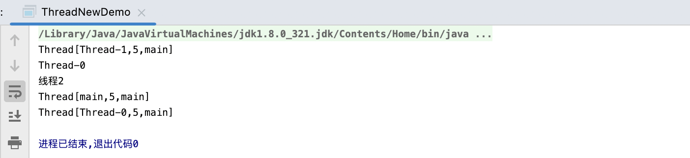
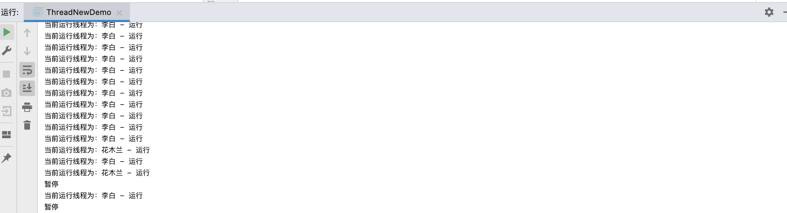
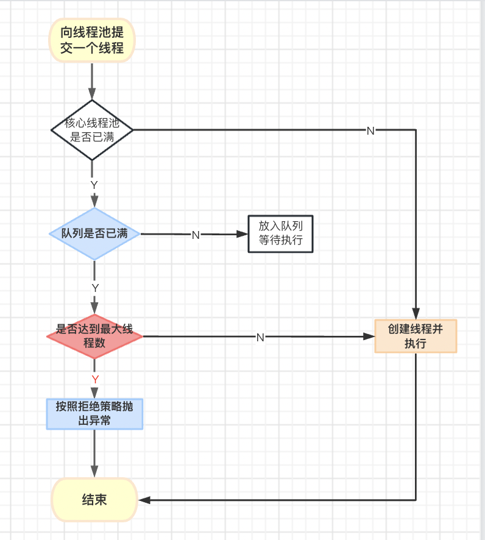

java多线程入门到进阶

<!-- more -->

#### 1.多线程相关概念

##### 1.1进程跟线程

**进程**：可以理解为是正在运行的程序实体个进程中的执行场景/执行单元，一个进程中包含多个进程

**线程**：是操作系统能够进行运算调度的最小单位，是完成进程中的最小执行单位

##### 1.2并行跟并发

**并行**：指同时发生两个并发事件，具有并发的含义。并发不一定并行，也可以说并发事件之间不一定要同一时刻发生。例如redis集群，把事情分给多个人去做，多线程的方式其实就是一种并行

**并发：**又称共行性，是指处理多个同时性活动的能力。类似抢购同一时间会有大量请求到同一个地方

##### 1.3**线程的生命周期**

1. 新建状态（创建线程的时候）

2. 就绪状态（未获取到cpu，等待执行）

3. 运行状态（获取到cpu执行权，线程执行）

4. 阻塞状态（线程进入阻塞状态，例如是用sleep线程执行暂停）

5. 死亡状态（释放cpu线程结束）


#### 2.java实现多线程

##### 2.1继承 `java.lang.Thread`，重写 `run方法`

比较简单，通过实例化这个子类，并调用start()方法来启动线程。这种方式的缺点也十分明显，因为java是单继承的，只能继承一个类局限性很大

```java
public class ThreadNewDemo extends Thread {

    @Override
    public void run() {
        // 编写程序，这段程序运行在分支线程中（分支栈）。
        for(int i = 0; i < 10; i++){
            System.out.println("分支线程--->" + i);
        }
    }

    public static void main(String[] args) {
        ThreadNewDemo threadNewDemo1 = new ThreadNewDemo();
        ThreadNewDemo threadNewDemo2 = new ThreadNewDemo();
        ThreadNewDemo threadNewDemo3 = new ThreadNewDemo();
        ThreadNewDemo threadNewDemo4 = new ThreadNewDemo();
        ThreadNewDemo threadNewDemo5 = new ThreadNewDemo();
        threadNewDemo1.start();
        threadNewDemo2.start();
        threadNewDemo3.start();
        threadNewDemo4.start();
        threadNewDemo5.start();
    }
```

##### 2.2.编写一个类，**实现** **`java.lang.Runnable`** 接口，实现`run方法`

这种方式相比较比继承`	Thread`类的方式更加灵活，这种方式的优点是灵活性高

```
public class RunnableNewDomo implements Runnable {

    @Override
    public void run() {
        // 编写程序，这段程序运行在分支线程中（分支栈）。
        for(int i = 0; i < 10; i++){
            System.out.println("分支线程--->" + i);
        }
    }


    public static void main(String[] args) {
        Thread thread1 = new Thread(new RunnableNewDomo());
        Thread thread2 = new Thread(new RunnableNewDomo());
        Thread thread3 = new Thread(new RunnableNewDomo());
        Thread thread4 = new Thread(new RunnableNewDomo());
        Thread thread5 = new Thread(new RunnableNewDomo());
        thread1.start();
        thread2.start();
        thread3.start();
        thread4.start();
        thread5.start();
    }
}
```

##### 2.3.还有一种是实现`Callable`接口

是在java1.5以后才加入的，这种方式与第二种方式类似，不同之处在于实现的是Callable接口而不是Runnable接口。Callable接口的call()方法可以返回一个结果，并且可以抛出异常。你可以使用ExecutorService来执行并返回一个Future对象，该对象可以用来获取任务的结果。这种方式的主要优点是可以返回结果和抛出异常，但它也需要你更多的代码来实现。

```
public class CallableNewDomo implements Callable<String> {

    @Override
    public String call() throws RuntimeException {
        // 编写程序，这段程序运行在分支线程中（分支栈）。
        for(int i = 0; i < 10; i++){
            System.out.println("分支线程--->" + i);
        }
        return "线程执行完成定义的返回值";
    }

    public static void main(String[] args) throws ExecutionException, InterruptedException {
        //启动方式1FutureTask
        CallableNewDomo callableNewDomo = new CallableNewDomo();
        FutureTask task = new FutureTask(callableNewDomo);
        Thread thread = new Thread(task);
        thread.start();
        task.get();
        //借助线程池启动
        CallableNewDomo callableNewDomo1 = new CallableNewDomo();
        ExecutorService executor = Executors.newSingleThreadExecutor();
        Future<String> submit = executor.submit(callableNewDomo1);
        submit.get();
        executor.shutdownNow();
    }
```

#### 3.线程常用的方法

##### 3.1线程名称操作

###### currentThread()

获取当前线程对象

###### getName()

获取线程对象名字

###### setName(String name)

修改线程对象名字(当没有设置名称的时候名字为：Thread-0，Thread-2.....类推)

实例：

```java
public class ThreadNewDemo extends Thread {

    @Override
    public void run() {
        System.out.println(currentThread());
    }

    public static void main(String[] args) {
        ThreadNewDemo threadNewDemo1 = new ThreadNewDemo();
        ThreadNewDemo threadNewDemo2 = new ThreadNewDemo();
        threadNewDemo1.start();
        threadNewDemo2.start();
        threadNewDemo2.setName("线程2");
        System.out.println(threadNewDemo1.getName());
        System.out.println(threadNewDemo2.getName());
        System.out.println(currentThread());
    }
}
```

结果：



##### 3.2sleep()方法使用

静态方法，让当前线程放弃占有的CPU资源进入休眠，进入阻塞状态。

##### 3.3stop()线程终止

<font color="red">注：已过期不建议使用，会有丢失数据的问题</font>

那么怎么合理终止一个线程呢

例：可以定义一个开关

```java
public class ThreadNewDemo extends Thread {

    private static  Boolean flg = true;
    
    @Override
    public void run() {
        while (true) {
            if (flg) {
                System.out.println("当前运行线程为：" + Thread.currentThread().getName() + " - 运行");
            } else {
                System.out.println("暂停");
                return;
            }
        }
    }
    
    public static void main(String[] args) throws InterruptedException {
        ThreadNewDemo threadNewDemo1 = new ThreadNewDemo();
        threadNewDemo1.setName("花木兰");
        ThreadNewDemo threadNewDemo2 = new ThreadNewDemo();
        threadNewDemo2.setName("李白");
        threadNewDemo1.start();
        threadNewDemo2.start();
        //让线程跑2秒
        Thread.sleep(2000);
        //暂停他
        flg = false;
    }
}
```

##### 3.4线程优先级

main线程的默认优先级是：**5**
优先级较高的，只是抢到的**CPU时间片**相对多一些。大概率方向更偏向于优先级比较高的。

例：

```java
public class ThreadNewDemo extends Thread {
    
    private static  Boolean flg = true;
    
    @Override
    public void run() {
        while (true) {
            if (flg) {
                System.out.println("当前运行线程为：" + Thread.currentThread().getName() + " - 运行");
            } else {
                System.out.println("暂停");
                return;
            }
        }
    }
    
    public static void main(String[] args) throws InterruptedException {
        ThreadNewDemo threadNewDemo1 = new ThreadNewDemo();
        threadNewDemo1.setName("花木兰");
        threadNewDemo1.setPriority(1);
        ThreadNewDemo threadNewDemo2 = new ThreadNewDemo();
        threadNewDemo2.setName("李白");
        threadNewDemo2.setPriority(10);
        threadNewDemo1.start();
        threadNewDemo2.start();
        Thread.sleep(20);
        //暂停他
        flg = false;
    }

}
```




##### 3.5线程礼让yield()

让位，当前线程暂停，回到就绪状态，让给其它线程。只是放弃当前cpu权，并不是每次都让成功的，有可能它又抢到时间片了。

##### 3.6线程加入join()

一个线程.join()，当前线程会进入”**`阻塞状态`**“。等待加入线程执行完！

```java
public class ThreadTest13 {
    
    public static void main(String[] args) {
        System.out.println("main begin");
        Thread t = new Thread(new MyRunnable7());
        t.setName("t");
        t.start();
        //合并线程
        try {
            t.join(); // t合并到当前线程中，当前线程受阻塞，t线程执行直到结束。
        } catch (InterruptedException e) {
            e.printStackTrace();
        }

        System.out.println("main over");
    }
}

class MyRunnable7 implements Runnable {

    @Override
    public void run() {
        for(int i = 0; i < 100; i++){
            System.out.println(Thread.currentThread().getName() + "--->" + i);
        }
    }
}
```

##### 3.7守护线程Daemon()

`Daemon`默认是false用户线程，手动设置为true以后就是守护线程，会等待所有的线程执行完再停止

```java
/**
 * 测试守护线程
 * 上帝守护你
 */
public class Demo23_DaemonThread {
    public static void main(String[] args) {
        God god = new God();
        You you = new You();

        Thread thread = new Thread(god);
        //默认false表示是用户线程,正常的线程都是用户线程...
        thread.setDaemon(true);
        //上帝守护线程启动
        thread.start();
        //你 用户线程启动
        new Thread(you).start();
    }
}

//上帝
class God implements Runnable{
    @Override
    public void run() {
        while (true){
            System.out.println("上帝保佑着你");
        }
    }
}

//你
class You implements Runnable{
    @Override
    public void run() {
        for (int i = 0; i < 36500; i++) {
            System.out.println("你一生都开心的活着");
        }
        System.out.println("====goodbye!world====");
    }
}
```

#### 4.线程安全

线程安全是什么，由于多个进程共享同一块存储空间，但是数据不同步，产生的数据安全问题

示例：抢票问题，由于多个线程之前数据不同步造成的超卖问题

```java
public class ThreadTest3 {

    public static void main(String[] args) {
        BuyTicket buyTicket = new BuyTicket();
        new Thread(buyTicket, "张三").start();
        new Thread(buyTicket, "李四").start();
        new Thread(buyTicket, "王五").start();
    }
}

class BuyTicket implements Runnable {
    //票
    private int ticketNums = 10;
    boolean flag = true;

    @Override
    public void run() {
        //买票
        while (flag) {
            try {
                buy();
            } catch (Exception e) {
                e.printStackTrace();
            }
        }
    }

    //买票
    private void buy() {
        //判断是否有票
        if (ticketNums <= 0) {
            flag = false;
            return;
        }
        //延迟
        try {
            Thread.sleep(1);
        } catch (InterruptedException e) {
            e.printStackTrace();
        }

        //买票
        System.out.println(Thread.currentThread().getName() + "拿到" + ticketNums--);
    }
}
```

结果:


##### 4.1解决方式一synchronized同步代码块

synchronized是Java中的关键字，被Java原生支持，是一种最基本的同步锁,Synchronized 方法控制对对象的访问，每个对象对应一把锁，每个 synchronized 方法都必须获取调用方法的对象的锁才能执行，否则线程会阻塞，方法一旦执行，就独占该锁，直到方法返回才释放锁，后面被阻塞的线程才能获得锁，继续执行；
`synchronized 修饰的方法只能一个对象调用完之后，另一个对象才能调用。锁的是调用该方法的对象。默认锁的this`

它修饰的对象有以下几种： 

```apl
 　　1. 修饰一个代码块，被修饰的代码块称为同步语句块，其作用的范围是大括号{}括起来的代码，作用的对象是调用这个代码块的对象。
 　　2. 修饰一个方法，被修饰的方法称为同步方法，其作用的范围是整个方法，作用的对象是调用这个方法的对象。
 　　3. 修饰一个静态的方法，其作用的范围是整个静态方法，作用的对象是这个类的所有对象。
 　
```
```java
public class a {

    private String str;


    synchronized void demo() {

    }

    static synchronized void demo2() {

    }

    void method() {
        synchronized (a.class) {

        }

        synchronized (str) {
            
        }
    }
    
}
```

**卖票问题解决**

```java
 //买票
    private synchronized void buy() {

        //判断是否有票
        if (ticketNums <= 0) {
            flag = false;
            return;
        }
        //延迟
        try {
            Thread.sleep(1);
        } catch (InterruptedException e) {
            e.printStackTrace();
        }

        //买票
        System.out.println(Thread.currentThread().getName() + "拿到" + ticketNums--);
    }
```

##### 4.2线程不安全的集合

```java
public class Demo26_UnsafeList {
    public static void main(String[] args) {
        List<String> list = new ArrayList<String>();
        for (int i = 0; i <10000; i++) {
            new Thread(()->{
                list.add(Thread.currentThread().getName());
            }).start();
        }
        System.out.println(list.size());
    }
}
```

多次运行输出结果ArrayList是线程不安全的

```apl
10000
99996
10002
```

**CopyOnWriteArrayList线程安全的集合**

```java
public class Demo26_UnsafeList {
    public static void main(String[] args) {
        ArrayList<String> list = new ArrayList<String>();
        for (int i = 0; i <10000; i++) {
            new Thread(()->{
                list.add(Thread.currentThread().getName());
            }).start();
        }
        //等待三秒让线程跑完
        try {
            Thread.sleep(3000);
        } catch (InterruptedException e) {
            e.printStackTrace();
        }
        System.out.println(list.size());
    }
}
```


#### 5.死锁

##### 5.1死锁产生的原因

死锁是由于两个或以上的线程互相持有对方需要的资源，导致这些线程处于等待状态，无法执行。

##### 5.2示例

两个Makeup对象分别先后获取口号或镜子一种资源后，加锁锁定资源，休眠1秒后然后再去获得下一个资源

```java
public class Demo31{
    public static void main(String[] args) {
        Makeup makeup = new Makeup(0, "灰姑娘");
        Makeup makeup1 = new Makeup(1, "白雪公主");
        makeup.start();
        makeup1.start();
    }
}

//口红
class Lipstick { }
//镜子
class Mirror { }

class Makeup extends Thread {
    //需要的资源只有一份,用static保证只有一份
    static Lipstick lipstick = new Lipstick();
    static Mirror mirror = new Mirror();
    int choice;//选择
    String girlName;//使用化妆品的人

    public Makeup(int choice, String girlName) {
        this.choice = choice;
        this.girlName = girlName;
    }

    @Override
    public void run() {
        //化妆
        try {
            makeup();
        } catch (InterruptedException e) {
            e.printStackTrace();
        }
    }

    private void makeup() throws InterruptedException {
        if (choice == 0) {
            synchronized (lipstick) {//获得口红的锁
                System.out.println(this.girlName + "获得口红的锁");
                Thread.sleep(1000);
                synchronized (mirror) {//一秒钟后想获得镜子
                    System.out.println(this.girlName + "获得镜子的锁");
                }
            }
        } else {
            synchronized (mirror) {//获得口红镜子
                System.out.println(this.girlName + "获得镜子的锁");
                Thread.sleep(2000);
                synchronized (lipstick) {//二秒钟后想获得的锁
                    System.out.println(this.girlName + "获得口红的锁");
                }
            }
        }
    }
}

```

**运行结果**


可以发现项目还是在运行状态的，白雪公主获得镜子并加锁，去获取口红，但是口红被灰姑娘获取后锁定，灰姑娘再去获取镜子，两个对象互不释放，也不停止，这个时候就产生了死锁

##### 5.3产生死锁的四个必要条件

死锁产生的四个必要条件，只要能打破一个就能打破死锁

一、互斥条件：一个资源只能被一个进程使用。

二、请求与保持条件：一个进程因请求资源阻塞时候，对已获取的资源保持不放。

三、不可剥夺条件：对已获得的资源，在未使用完之前，不可剥夺。

四、循环等待条件：发生死锁时，线程进入死循环，永久阻塞。

##### 6.Lock（锁）

Lock是一种显示的锁，可以手动开启跟关闭，`ReentrantLock`事Lock的一个实现类,最常用

###### 示例

```java
//测试Lock锁
public class Demo32_ThreadLock {
    public static void main(String[] args) {
        TestLock testLock = new TestLock();
        new Thread(testLock).start();
        new Thread(testLock).start();
        new Thread(testLock).start();
    }
}

class TestLock implements Runnable {
    int tickerNums = 10;
    //定义Lock锁
    private final ReentrantLock lock = new ReentrantLock();

    @Override
    public void run() {
        while (true) {
            //加锁
            try {
                lock.lock();
                if (tickerNums <= 0) {
                    break;
                }
                try {
                    Thread.sleep(1000);
                } catch (InterruptedException e) {
                    e.printStackTrace();
                }
                System.out.println(tickerNums--);
            } catch (Exception e) {
                e.printStackTrace();
            } finally {
                //解锁
                lock.unlock();
            }
        }
    }
}

```

#### 7.线程通讯问题

##### **7.1场景描述**

生产者：Production.class   消费者：Consumer.class   仓库：Container.class

生产者生产完商品放入仓库

仓库满10件打包好让消费者取走，怎么在仓库放满以后通知消费者消费呢 

##### 7.2java提供的api

线程通讯的api为Object类提供，都只能在同步方法或者是同步类中使用，否则会抛出异常

###### wait()|wait(long time)

表示线程进入等待，与sleep不同的是，会释放锁  

###### notify()|notifyAll()

唤醒一个或者多个正在等待的线程，优先级多的会优先调度

示例：

```java
/**
 * 测试:生产者消费者模型-->利用缓冲区解决:管程法
 */
public class Demo33_ThreadPC {
    public static void main(String[] args) {
        SynContainer synContainer = new SynContainer();
        new Producer(synContainer).start();
        new Consumer(synContainer).start();
    }
}

//生产者
class Producer extends Thread {
    //容缓冲区
    SynContainer container;

    public Producer(SynContainer container) {
        this.container = container;
    }

    //生产
    @Override
    public void run() {
        for (int i = 0; i < 100; i++) {
            container.push(new Product(i));
            System.out.println("生产了" + i + "件产品");
        }
    }
}

//消费者
class Consumer extends Thread {
    //容缓冲区
    SynContainer container;

    public Consumer(SynContainer container) {
        this.container = container;
    }

    //消费
    @Override
    public void run() {
        for (int i = 0; i < 100; i++) {
            System.out.println("消费了-->" + container.pop().id + "件产品");
        }
    }
}

//产品
class Product {
    int id;//产品编号

    public Product(int id) {
        this.id = id;
    }
}

//缓冲区
class SynContainer {
    //需要一个容器大小
    Product[] products = new Product[10];
    //容器计数器
    int count = 0;

    //生产者放入产品
    public synchronized void push(Product product) {
        //如果容器满了,需要等待消费者消费
        /*如果是if的话，假如消费者1消费了最后一个，这是index变成0此时释放锁被消费者2拿到而不是生产者拿到，这时消费者的wait是在if里所以它就直接去消费index-1下标越界，如果是while就会再去判断一下index得值是不是变成0了*/
        while (count == products.length) {
            //通知消费者消费,等待生产
            try {
                this.wait();
            } catch (InterruptedException e) {
                e.printStackTrace();
            }
        }
        //如果没有满,需要丢入产品
        products[count] = product;
        count++;
        //通知消费者消费
        this.notifyAll();
    }

    //消费者消费产品
    public synchronized Product pop() {
        //判断是否能消费
        while (count <= 0) {
            //等待生产者生产
            try {
                this.wait();
            } catch (InterruptedException e) {
                e.printStackTrace();
            }
        }
        //如果可以消费
        count--;
        Product product = products[count];
        //吃完了 通知生产者生产
        this.notifyAll();
        return product;
    }
}
```

#### 8.线程池**ThreadPoolExecutor**

##### 8.1为什么要使用线程池

其实主要作用就是统一管理线程，统一开启关闭,

- 降低资源的消耗
- 提高响应的速度
- 方便管理、
##### 8.2ThreadPoolExecutor源码

**参数最多的构造方法**

```java
public ThreadPoolExecutor(int corePoolSize,
                              int maximumPoolSize,
                              long keepAliveTime,
                              TimeUnit unit,
                              BlockingQueue<Runnable> workQueue,
                              ThreadFactory threadFactory,
                              RejectedExecutionHandler handler) {
        if (corePoolSize < 0 ||
            maximumPoolSize <= 0 ||
            maximumPoolSize < corePoolSize ||
            keepAliveTime < 0)
            throw new IllegalArgumentException();
        if (workQueue == null || threadFactory == null || handler == null)
            throw new NullPointerException();
        this.acc = System.getSecurityManager() == null ?
                null :
                AccessController.getContext();
        this.corePoolSize = corePoolSize;
        this.maximumPoolSize = maximumPoolSize;
        this.workQueue = workQueue;
        this.keepAliveTime = unit.toNanos(keepAliveTime);
        this.threadFactory = threadFactory;
        this.handler = handler;
    }
```

##### 8.3线程池参数

**corePoolSize**(必须)：

核心线程数。默认情况下，核心线程会一直存活，但是当将 **allowCoreThreadTimeout** 设置为 true 时，核心线程也会超时回收。

**maximumPoolSize**（必需）：

线程池所能容纳的最大线程数。当活跃线程数达到该数值后，后续的新任务将会阻塞。

**keepAliveTime**（必需）：

线程闲置超时时长。如果超过该时长，非核心线程就会被回收。如果将 **allowCoreThreadTimeout** 设置为 true 时，核心线程也会超时回收。

**unit**（必需）：

指定 keepAliveTime 参数的时间单位。常用的有：**TimeUnit.MILLISECONDS**（毫秒）、**TimeUnit.SECONDS**（秒）、**TimeUnit.MINUTES**（分）。

**workQueue**（必需）：

任务队列。通过线程池的 execute() 方法提交的 Runnable 对象将存储在该参数中。其采用阻塞队列实现。在 Java 中需要实现 **BlockingQueue** 接口。

 Java 提供的 7 种阻塞队列的实现：

###### ArrayBlockingQueue：

一个由数组结构组成的有界阻塞队列（数组结构可配合指针实现一个环形队列）。

###### LinkedBlockingQueue：

 一个由链表结构组成的有界阻塞队列，在未指明容量时，容量默认为 Integer.MAX_VALUE。

###### PriorityBlockingQueue：

 一个支持优先级排序的无界阻塞队列，对元素没有要求，可以实现 Comparable 接口也可以提供 Comparator 来对队列中的元素进行比较。跟时间没有任何关系，仅仅是按照优先级取任务。

###### DelayQueue：

类似于PriorityBlockingQueue，是二叉堆实现的无界优先级阻塞队列。要求元素都实现 Delayed 接口，通过执行时延从队列中提取任务，时间没到任务取不出来。

###### SynchronousQueue：

 一个不存储元素的阻塞队列，消费者线程调用 take() 方法的时候就会发生阻塞，直到有一个生产者线程生产了一个元素，消费者线程就可以拿到这个元素并返回；生产者线程调用 put() 方法的时候也会发生阻塞，直到有一个消费者线程消费了一个元素，生产者才会返回。

###### LinkedBlockingDeque：

 使用双向队列实现的有界双端阻塞队列。双端意味着可以像普通队列一样 FIFO（先进先出），也可以像栈一样 FILO（先进后出）。

###### LinkedTransferQueue：

 它是ConcurrentLinkedQueue、LinkedBlockingQueue 和 SynchronousQueue 的结合体，但是把它用在 ThreadPoolExecutor 中，和 LinkedBlockingQueue 行为一致，但是是无界的阻塞队列。

**threadFactory**（可选）：

线程工厂。用于指定为线程池创建新线程的方式。在 Java 中需要实现 **BlockingQueue** 接口。但 Java 已经为我们提供了 7 种阻塞队列的实现：

```java
/**
 * The default thread factory.
 */
private static class DefaultThreadFactory implements ThreadFactory {
    private static final AtomicInteger poolNumber = new AtomicInteger(1);
    private final ThreadGroup group;
    private final AtomicInteger threadNumber = new AtomicInteger(1);
    private final String namePrefix;
 
    DefaultThreadFactory() {
        SecurityManager s = System.getSecurityManager();
        group = (s != null) ? s.getThreadGroup() :
                              Thread.currentThread().getThreadGroup();
        namePrefix = "pool-" +
                      poolNumber.getAndIncrement() +
                     "-thread-";
    }
 
    public Thread newThread(Runnable r) {
        Thread t = new Thread(group, r,
                              namePrefix + threadNumber.getAndIncrement(),
                              0);
        if (t.isDaemon())
            t.setDaemon(false);
        if (t.getPriority() != Thread.NORM_PRIORITY)
            t.setPriority(Thread.NORM_PRIORITY);
        return t;
    }
}
```


**handler**（可选）：

拒绝策略。当达到最大线程数时需要执行的饱和策略。拒绝策略需要实现 RejectedExecutionHandler 接口，并实现 rejectedExecution(Runnable r, ThreadPoolExecutor executor) 方法。不过 Executors 框架已经为我们实现了 4 种拒绝策略：

###### **AbortPolicy（默认）：**

丢弃任务并抛出 RejectedExecutionException 异常。

###### **CallerRunsPolicy：**

由调用线程处理该任务。

###### **DiscardPolicy：**

丢弃任务，但是不抛出异常。可以配合这种模式进行自定义的处理方式。

###### DiscardOldestPolicy：

丢弃队列最早的未处理任务，然后重新尝试执行任务。

------------------------------------------------
版权声明：本文为CSDN博主「孙强 Jimmy」的原创文章，遵循CC 4.0 BY-SA版权协议，转载请附上原文出处链接及本声明。
原文链接：https://blog.csdn.net/u013541140/article/details/95225769

##### 8.4线程池创建示例

```java
public static void main(String[] args) {
    ThreadPoolExecutor threadPoolExecutor = new ThreadPoolExecutor(
            10,
            20,
            1000,
            TimeUnit.MICROSECONDS,
            new LinkedBlockingQueue<>(100),
            new ThreadPoolExecutor.AbortPolicy());
}
```

流程图



#### 9.java封装好的功能线程池

##### 定长线程池

**特点**：只有核心线程数，执行完立即回收，任务队列胃链表结构的有界队列。

应用场景：控制最大并发数

```java
public class Dede implements Runnable {

    public static void main(String[] args) {
        ExecutorService executorService = Executors.newFixedThreadPool(10);
        Dede dede = new Dede();
        Thread thread = new Thread(dede);
        thread.start();
        executorService.submit(thread);
    }
    
    @Override
    public void run() {
        System.out.println(Thread.currentThread().getName());
    }
}
```

##### 定时线程池

**特点**：核心线程数固定，非核心线程数量无限，执行完闲置任务回收，任务队列胃延时阻塞队列

应用场景：需要周期性的执行任务

```java
public static void main(String[] args) {
        Dede dede = new Dede();
        Thread thread = new Thread(dede);
        ScheduledExecutorService service = Executors.newScheduledThreadPool(10);
        // 延迟1s后执行任务
        service.schedule(thread, 1, TimeUnit.SECONDS);
        // 延迟10ms后、每隔1000ms执行任务
        service.scheduleAtFixedRate(thread,10,1000,TimeUnit.MILLISECONDS);
    }

    @Override
    public void run() {
        System.out.println(Thread.currentThread().getName());
    }
```

##### 可缓存线程池

特点：无核心线程，非核心线程数量无限，执行完闲置60s后回收，任务队列为不储存元素的阻塞队列

应用场景：大量任务，耗时少的任务

```java
public class Dede implements Runnable {

    public static void main(String[] args) {
        Dede dede = new Dede();
        Thread thread = new Thread(dede);
        ExecutorService executorService = Executors.newCachedThreadPool();
        executorService.execute(thread);
    }

    @Override
    public void run() {
        System.out.println(Thread.currentThread().getName());
    }
}
```

##### 单线程化线程池

特点：只有一个核心线程，无非核心线程，执行完立即回收，任务队列为链表的有界队列。

应用场景：不适合并发但可能引起 IO 阻塞性及影响 UI 线程响应的操作，如数据库操作、文件操作等。

```
public static void main(String[] args) {
        Dede dede = new Dede();
        Thread thread = new Thread(dede);
        ExecutorService executorService = Executors.newSingleThreadExecutor();
        executorService.execute(thread);
    }

    @Override
    public void run() {
        System.out.println(Thread.currentThread().getName());
    }
```

##### 9.2使用java预编线程池劣势

Executors 的 4 个功能线程池虽然方便，但现在已经不建议使用了，而是建议直接通过使用 ThreadPoolExecutor 的方式，这样的处理方式让写的同学更加明确线程池的运行规则，规避资源耗尽的风险。

**FixedThreadPool （定长线程池）和 SingleThreadExecutor（单例线程池）：主要问题是堆积的请求处理队列均采用 LinkedBlockingQueue，可能会耗费非常大的内存，甚至 OOM。**
**CachedThreadPool 和 ScheduledThreadPool：主要问题是线程数最大数是 Integer.MAX_VALUE，可能会创建数量非常多的线程，甚至 OOM。**

##### 线程池相关补充：

`execute()` vs `submit()`的区别

execute()方法 适合用于不需要返回值的任务

submit()方法 适用于需要返回值的任务，线程池会返回一个`Future`类型的对象，通过这个对象可以看返回是否成功

#### 10.JUC

##### 10.1JUC是什么

JUC是java.util.concurrent包的简称，在jdk5添加，是为了更好的支持高并发任务的一些工具

##### 10.2线程通信

在原有的基础上支持了精准唤醒

Condition:信号

condition.signal()唤醒当前Condition

condition.await();当前线程挂起

**示例**

```java
public class A1 {

    public static void main(String[] args) {
        // A英特尔 C主厂商 B组装厂 A生产一个cpu通知C生产一个主板 当有一个主板一个cpu时候 组装厂完成组装
        Data1 data = new Data1();
        new Thread(() -> {
            for (int i = 0; i < 10; i++) {
                try {
                    data.addCpu();
                } catch (InterruptedException e) {
                    throw new RuntimeException(e);
                }
            }
        }, "A").start();
        new Thread(() -> {
            try {
                for (int i = 0; i < 10; i++) {
                    data.addMbd();
                }
            } catch (InterruptedException e) {
                throw new RuntimeException(e);
            }
        }, "C").start();
        new Thread(() -> {
            try {
                for (int i = 0; i < 10; i++) {
                    data.d();
                }
            } catch (InterruptedException e) {
                throw new RuntimeException(e);
            }
        }, "B").start();
    }
}
class Data1 {

    Lock lock = new ReentrantLock();

    Condition condition1 = lock.newCondition();
    Condition condition2 = lock.newCondition();
    Condition condition3 = lock.newCondition();

    int cpuNumber = 0;

    int mbdNumber = 0;

    public  void addCpu() throws InterruptedException {
        try {
            lock.lock();
            while (cpuNumber != 0) {
                condition1.await();
            }
            cpuNumber++;
            System.out.println(Thread.currentThread().getName() + "生产了一件CPU剩余" + cpuNumber);
            condition2.signal();
        } finally {
            lock.unlock();
        }
    }

    public  void addMbd() throws InterruptedException {
        try {
            lock.lock();
            while (mbdNumber != 0) {
                condition2.await();
            }
            mbdNumber++;
            System.out.println(Thread.currentThread().getName() + "生产了一件主板剩余" + mbdNumber);
            condition3.signal();
        } finally {
            lock.unlock();
        }
    }

    public  void d() throws InterruptedException {
        try {
            lock.lock();
            while (cpuNumber == 0 || mbdNumber == 0) {
                condition3.await();
            }
            cpuNumber--;
            mbdNumber--;
            System.out.println(Thread.currentThread().getName() + "组装一台主机====剩余cpu 主板" + cpuNumber + mbdNumber);
            condition1.signal();
        } finally {
            lock.unlock();
        }
    }
}
```

##### 线程安全集合

###### 线程安全的List**`CopyOnWriteArrayList`**

`CopyOnWriteArrayList` 和 `Vector` 是两种线程安全的 List 实现，但它们有一些关键的区别。

1. **线程安全机制：**
   - **`CopyOnWriteArrayList`：** 使用写时复制（Copy-On-Write）策略，即在对容器进行修改时，不直接修改原始数据，而是复制一份数据副本进行修改，完成后再将引用指向新的数据副本。这样可以保证读取操作的线程不受写入操作的影响，从而实现读写并发。
   - **`Vector`：** 使用传统的同步方法，通过在每个方法上使用 `synchronized` 关键字来保证线程安全。这意味着在进行修改操作时，整个对象被锁住，可能导致并发性能下降。
2. **性能：**
   - **`CopyOnWriteArrayList`：** 适用于读多写少的场景，因为写操作会导致数据的复制，可能在并发写入较频繁的情况下产生较高的开销。
   - **`Vector`：** 性能相对较低，因为在进行任何修改操作时都需要获取对象级别的锁，可能导致较高的竞争和等待。

###### 线程安全的set`CopyOnWriteArraySet`

与list同理

###### 线程安全的map`ConcurrentHashMap`

1. **同步策略：**
   - **`ConcurrentHashMap`：** 使用分段锁（Segment）来实现并发控制。不同的段可以独立进行读写操作，从而提高并发性。多个线程可以同时读取，写入操作也可以并行进行，只有在对同一个段进行读写时才需要进行同步。
   - **`Hashtable`：** 使用单一锁来对整个数据结构进行同步。这意味着一次只有一个线程可以对 `Hashtable` 进行读写操作，这可能导致性能瓶颈，尤其是在高并发的情况下。
2. **性能：**
   - **`ConcurrentHashMap`：** 在读取和写入操作上相对高效，尤其在高并发环境下。每个段的锁可以独立操作，从而提高并发性。
   - **`Hashtable`：** 在写入操作上需要进行整个数据结构的同步，可能导致性能瓶颈，特别是在高并发环境下。

##### 常用的辅助类

```java
public class Demo3 {
    public static void main(String[] args) throws Exception {
        //CountDownLatch
        System.out.println("一天只能打豆豆六次");
        CountDownLatch countDownLatch = new CountDownLatch(6);
        for (int i = 0; i < 6; i++) {
            new Thread(() -> {
                System.out.println(Thread.currentThread().getName() + "-1");
                countDownLatch.countDown();
            }, "打豆豆").start();
        }
        countDownLatch.await();
        System.out.println("已经结束了");

        //CyclicBarrier
        System.out.println("一天要吃三顿饭");
        CyclicBarrier cyclicBarrier = new CyclicBarrier(3);

        for (int i = 0; i < 3; i++) {
            new Thread(() -> {
                System.out.println("吃一顿饭");
                try {
                    cyclicBarrier.await();
                } catch (InterruptedException e) {
                    throw new RuntimeException(e);
                } catch (BrokenBarrierException e) {
                    throw new RuntimeException(e);
                }
            }).start();
        }
        cyclicBarrier.await();
        System.out.println("吃完了");

        // Semaphore
        System.out.println("只能有两个人玩switch马里奥惊奇");
        Semaphore semaphore = new Semaphore(2);
        List<String> list = Arrays.asList("张三", "李四", "王五", "赵六", "田七", "郭八");
        for (String name : list) {
            new Thread(() -> {
                try {
                    semaphore.acquire();
                    System.out.println(Thread.currentThread().getName() + "玩上了switch");
                    TimeUnit.SECONDS.sleep(3);
                } catch (InterruptedException e) {
                    throw new RuntimeException(e);
                } finally {
                    semaphore.release();
                }
            }, name).start();
        }
    }
}
```

##### 读写锁ReadWriteLock

读锁可以共享，写锁为普通的互斥锁

demo

```java

public class SharedResource {
    private int data = 0;
    private final ReadWriteLock lock = new ReentrantReadWriteLock();

    public int readData() {
        lock.readLock().lock();
        try {
            // 执行读取操作
            return data;
        } finally {
            lock.readLock().unlock();
        }
    }

    public void writeData(int newData) {
        lock.writeLock().lock();
        try {
            // 执行写入操作
            data = newData;
        } finally {
            lock.writeLock().unlock();
        }
    }

    public static void main(String[] args) {
        SharedResource resource = new SharedResource();

        // 多个线程读取数据
        for (int i = 0; i < 5; i++) {
            new Thread(() -> {
                int value = resource.readData();
                System.out.println("Read data: " + value);
            }).start();
        }

        // 一个线程写入数据
        new Thread(() -> {
            resource.writeData(42);
            System.out.println("Write data: 42");
        }).start();
    }
}

```

##### 阻塞队列

BlockingQueue（阻塞队列）接口继承了Queue接口。

常用实现类：

ArrayBlockingQueue LinkedBlockingQueue SynchronousQueue(同步队列！！！只能放一个数据，一放一出)


