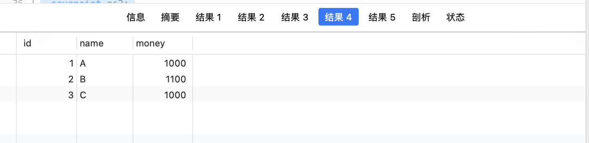

MySQL事务and使用方式总结

<!-- more -->

#### 一、Mysql 事务的概念

  Mysql 事务主要用于处理操作量大，复杂度高的数据。比如说，在人员管理系统中， 要删除一个人员，既需要删除人员的基本资料，又需要删除和该人员相关的信息，如信箱， 文章等等。这样，这些数据库操作语句就构成一个事务！

事务是一种机制、一个操作序列，包含了一组数据库操作命令，并且把所有的命令作为一个整体一起向系统提交或撤销操作请求，即这一组数据库命令要么都执行，要么都不执行。
事务是一个不可分割的工作逻辑单元，在数据库系统上执行并发操作时，事务是最小的控制单元。
事务适用于多用户同时操作的数据库系统的场景，如银行、保险公司及证券交易系统等等。
事务是通过事务的整体性以保证数据的一致性。
  简单来说，所谓事务，它是一个操作序列，这些操作要么都执行，要么都不执行，它是一个不可分割的工作单位。

#### 二、事务的特性（ACID）

##### 1.原子性

###### 概念：

每个事务都是单独的不可再分的工作单位，要么整个事务都操作成功，要么全部失败

###### 案例：

  A给B转帐100元钱的时候只执行了扣款语句，就提交了，此时如果突然断电，A账号已经发生了扣款，B账号却没收到加款，在生活中就会引起纠纷。这种情况就需要事务的原子性来保证事务要么都执行，要么就都不执行。

##### 2.一致性

###### 概念：

事务在执行前后，数据库的数据完整性没有被破坏，即事务执行前后数据保持一致

即：

事务执行前数据保持一致

事务执行中数据可能不一致

事务执行后数据保持一致

###### 案例

  对银行转帐事务，不管事务成功还是失败，应该保证事务结束后表中A和B的存款总额跟事务执行前一致。

##### 3.隔离性

概念：

事务之前互不影响，当不同的事务同时操纵相同的数据时，每个事务都有各自的完整数据空间。

##### 4.持久性

###### 概念：

在事务完成以后，该事务所对数据库所作的更改便持久的保存在数据库之中

#### 三、事务之间的相互影响

##### 1.脏读

###### 概念：

脏读是指读到了其他事物未提交的数据，未提交的事物可能会回滚。然后你读到的数据会跟数据库实际数据不一致，产生脏读。

###### 案例：

比如事务B执行过程中修改了数据X,在未提交前,事务A读取了X,而事务B却回滚了,这样事务A就形成了脏读。 也就是说,当前事务读到的数据是别的事务想要修改成为的但是没有修改成功的数据。

##### 2.不可重复读

###### 概念：

一个事物内多次查询出来的数据不一致。原因：查询前后间隔有其他事物提交，更改了数据

###### 案例：
  事务A第一次查询得到一行记录row1，事务B提交修改后，事务A第二次查询得到row1，但列内容发生了变化。

##### 3.幻读

###### 概念：

前后多次读取数据不一致，一个事物对表中的数据修改涉及所有的行。在事物提交前，有另一个事物在表中插入数据，作前一个事务的用户会发现表中还有没有修改的数据行，就好象发生了幻觉一样。

###### 案列：

  假设事务A对某些行的内容作了更改，但是还未提交，此时事务B插入了与事务A更改前的记录相同的记录行，并且在事务A提交之前先提交了，而这时，在事务A中查询，会发现好像刚刚的更改对于某些数据未起作用，但其实是事务B刚插入进来的，让用户感觉很魔幻，感觉出现了幻觉，这就叫幻读。

##### 4.丢失更新

###### 概念：

两个事务同时读取同一条记录，A 先修改记录，B 也修改记录（B 不知道 A 修改过），B 提交数据后 B 的修改结果覆盖了 A 的修改结果。

###### 案例：

案列
A 30 ->40 事务先完成
B 30 ->50 事务后完成
B的事务结果会覆盖A的事务结果，最终值为50

#### 四、事务的隔离级别

##### 1.事物隔离级别分类

- ==read uncommitted==（`==**未提交读**==`）：读取尚未提交的数据 — 会产生脏读

​       注：可以读到事务未提交的变更，会产生脏读问题

- ==read committed==（`==提交读==`）：读取已经提交的数据 — 可以解决脏读

 	<!--只能读取到已经提交的数据。Oracle 等多数数据库默认都是该级别。-->

- ==repeatable read==（`==可重复度==`）：重读读取 — 可以解决脏读和不可重复读（mysql 默认）

​       注：可重复读。无论其他事务是否修改并提交了数据，在这个事务中看到的数据值始终不受其他事务影响。

- ==serializable==（`串行化`）可以解决脏读，不可重复读，幻读-相当于锁表的表锁

  注：完全串行化的读，每次读都需要获得表级共享锁，读写相互都会阻塞。

##### 2.事务隔离级别作用范围

- 全局级：对所有的会话有效
- 会话级：只对当前的会话有效

##### 3.1设置全局隔离级别

##### 全局

###### 1.读未提交

set global transaction isolation level read uncommitted;

###### 2.读提交

set global transaction isolation level read committed;

###### 3.重复读

set global transaction isolation level repeatable read;

###### 4.串行化

set global transaction isolation level serializable;

##### 当前会话

设置当前会话隔离级别

global   替换为  session

##### 3.2查看当前隔离级别

##### 当前会话隔离级别

select @@tx_isolation;<!--8.0之前版本-->

select @@transaction_isolation;<!--8.0以后版本-->

#### 五、事务控制语句

##### 事务开启

 ```BEGIN ｜ START TRANSACTION```

显式地开启一个事务。

##### 提交事务

```COMMIT ｜ COMMIT WORK：```

提交事务，并使已对数据库进行的所有修改变为永久性的。

##### 回滚事务

```ROLLBACK ｜ ROLLBACK WORK```

回滚会结束用户的事务，并撤销正在进行的所有未提交的修改。

##### 标记回滚点

```SAVEPOINT S1```

使用 SAVEPOINT 允许在事务中创建一个回滚点，一个事务中可以有多个 SAVEPOINT。"S1" 代表回滚点名称。

##### 回滚到回滚点

```ROLLBACK TO [SAVEPOINT] S1```

把事务回滚到标记点。

#### 六、事务操作示例

##### 1.创建测试数据库

```mysql
CREATE TABLE info ( id INT ( 10 ) PRIMARY KEY NOT NULL, NAME VARCHAR ( 40 ), money DOUBLE );

INSERT INTO info
VALUES
	( 1, 'A', 1000 );
INSERT INTO info
VALUES
	( 2, 'B', 1000 );
```

##### 2.测试创建提交事务

```mysql
begin;
update info set money= money - 100 where name='A';
select * from info;
commit;
```

运行结果：

因为是在一个事务里 ，查询到的结果就是update后的结果


##### 3.测试回滚事务

```mysql
	BEGIN;
	update info set money= money + 100 where name='A';
  select * from info;
	rollback;
	select * from info
```

运行结果：

结果1因为是在事务里面，查到了update的数据。	```rollback```回滚会结束事务，所以结果2查到的是回滚后，操作前原本的数据


##### 4.测试多点回滚

```mysql
	BEGIN;
	SELECT * from info;
	update info set money= money + 100 where name='A';
	select * from info;
	savepoint gs1;
	update info set money= money + 100 where name='B';
  select * from info;
	savepoint gs2;
	insert into info values(3,'C',1000);
	select * from info;
	rollback to gs1;
	select * from info;
```

运行结果：


结果1:原数据


结果2:数据update name=A 加100的结果


结果3:数据update name=B 加100的结果


结果4:insert语句后的结果



结果5:回滚到节点gs1的结果


#### 七、事务提交方式

##### 查看当前提交方式

SHOW VARIABLES LIKE 'AUTOCOMMIT';

##### 自动提交

SET AUTOCOMMIT=1;

##### 手动提交

SET AUTOCOMMIT=1;

注：如果没有开启自动提交，当前会话连接的 mysql 的所有操作都会当成一个事务直到你输入 rollback|commit；当前事务才算结束。当前事务结束前新的 mysql 连接时无法读取到任何当前会话的操作结果。
如果开起了自动提交，mysql 会把每个 sql 语句当成一个事务，然后自动的 commit。
当然无论开启与否，begin; commit|rollback; 都是独立的事务。

