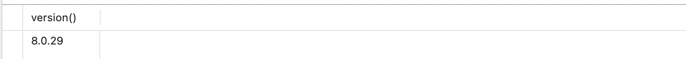

msyql分组查询报错

<!-- more -->

##### 问题

###### user表数据


###### love表数据


使用分组查询sql语句报错

```sql
SELECT
	u.*, GROUP_CONCAT(l.like) as likeList,l.id
FROM
	`user` u
	INNER JOIN love l ON u.id = l.user_id 
GROUP BY
	u.id
```

##### 报错

1055 - Expression #4 of SELECT list is not in GROUP BY clause and contains nonaggregated column 'group_demo.l.id' which is not functionally dependent on columns in GROUP BY clause; this is incompatible with sql_mode=only_full_group_by

存在未分组中的数据

**一直是这样写的，之前也没遇到这个问题**

##### 探索原因

在网上一顿搜索后发现这个错误信息和sql_mode中的”only_full_group_by”有关，是Mysql5.7 group by新特性，在5.7版本以后中only_full_group_by这个模式是默认开启的

###### 查看mysql版本

```mysql
select version() from dual;
```



###### **查看`sql_mode`配置**

```mysql
select @@global.sql_mode;
```

结果：


```tex
ONLY_FULL_GROUP_BY,STRICT_TRANS_TABLES,NO_ZERO_IN_DATE,NO_ZERO_DATE,ERROR_FOR_DIVISION_BY_ZERO,NO_ENGINE_SUBSTITUTION
```

<font color=red>ONLY_FULL_GROUP_BY</font>是开启的，所以原因是这个

###### 其他值

sql_mode常用值如下:

```apl
ONLY_FULL_GROUP_BY:

对于GROUP BY聚合操作,如果在SELECT中的列,没有在GROUP BY中出现,那么这个SQL是不合法的,因为列不在GROUP BY从句中
NO_AUTO_VALUE_ON_ZERO:
该值影响自增长列的插入。默认设置下,插入0或NULL代表生成下一个自增长值。如果用户 希望插入的值为0,而该列又是自增长的,那么这个选项就有用了。
STRICT_TRANS_TABLES:
在该模式下,如果一个值不能插入到一个事务表中,则中断当前的操作,对非事务表不做限制
NO_ZERO_IN_DATE:
在严格模式下,不允许日期和月份为零
NO_ZERO_DATE:
设置该值,mysql数据库不允许插入零日期,插入零日期会抛出错误而不是警告。
ERROR_FOR_DIVISION_BY_ZERO:
在INSERT或UPDATE过程中,如果数据被零除,则产生错误而非警告。如 果未给出该模式,那么数据被零除时MySQL返回NULL
NO_AUTO_CREATE_USER:
禁止GRANT创建密码为空的用户
NO_ENGINE_SUBSTITUTION:
如果需要的存储引擎被禁用或未编译,那么抛出错误。不设置此值时,用默认的存储引擎替代,并抛出一个异常
PIPES_AS_CONCAT:
将"||"视为字符串的连接操作符而非或运算符,这和Oracle数据库是一样的,也和字符串的拼接函数Concat相类似
ANSI_QUOTES:
启用ANSI_QUOTES后,不能用双引号来引用字符串,因为它被解释为识别符
```

##### 解决：

其实报错原因实际是分组语句不规范

**Group By正确的用法**
**myql的group by语法为：**
**select 选取分组中的列 + 聚合函数 from 表名称 group by 分组的列**
**从语法格式来看，是现有分组，在确定检索的列，检索的列只能是参加分组了的列。**
**所以问题中，group by 后的a,b,c是先确定的，而select 后面的字段是可变的**

其他方式一：

删除sql_mode中的值！！！修改mysql配置my.cnf(windows下面是my.ini)

方式二：

通过mysql的any_value()函数，**any_value()会选择被分到同一组的数据里第一条数据的指定列值作为返回数据**

修改sql重新执行

```mysql
SELECT
	u.*,GROUP_CONCAT(l.like) as likeList,any_value(l.id)
FROM
	`user` u
	INNER JOIN love l ON u.id = l.user_id 
GROUP BY
	u.id
```


