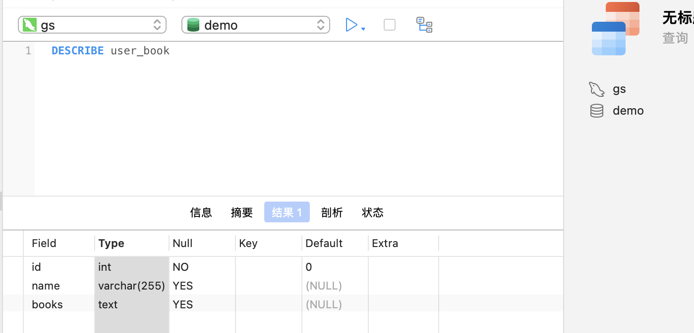

---

title: mysql视图
date: 2022-12-07 14:20:24
tags:
- mysql
categories:
- 数据库
cover: /images/cha/g1.jpeg
coverWidth: 1200
coverHeight: 320
---

MySQL视图使用

<!-- more -->

#### mysql视图介绍

##### 简介

1.mysql视图（view）是一种虚拟存在的表。同真实的表一样，可以增删改查,跟普通表连接查询等操作，可以当作普通表来使用

2.视图中并不存放数据，只记录了定义视图的查询语句

3.视图中的数据依赖于真实表数据，数据结构发生变化，你需要更改视图的查询语句

#### 使用

##### demo示例表

**user:**

```mysql
CREATE TABLE `user` (
  `id` int NOT NULL AUTO_INCREMENT,
  `name` varchar(255) DEFAULT NULL,
  PRIMARY KEY (`id`)
) ENGINE=InnoDB DEFAULT CHARSET=utf8mb4 COLLATE=utf8mb4_0900_ai_ci;
```

```mysql
INSERT INTO `demo`.`user` (`id`, `name`) VALUES (1, '路遥');
INSERT INTO `demo`.`user` (`id`, `name`) VALUES (2, '刘慈欣');
```

**book:**

```mysql
CREATE TABLE `book` (
  `id` int NOT NULL AUTO_INCREMENT,
  `book_name` varchar(255) DEFAULT NULL,
  `user_id` int DEFAULT NULL,
  PRIMARY KEY (`id`)
) ENGINE=InnoDB DEFAULT CHARSET=utf8mb4 COLLATE=utf8mb4_0900_ai_ci;
```

```mysql
INSERT INTO `demo`.`book` (`id`, `book_name`, `user_id`) VALUES (1, '平凡的世界', 1);
INSERT INTO `demo`.`book` (`id`, `book_name`, `user_id`) VALUES (2, '三体', 2);
INSERT INTO `demo`.`book` (`id`, `book_name`, `user_id`) VALUES (3, '人生', 1);
```

##### 视图创建

**语法：**

CREATE VIEW <视图名> AS <SELECT语句>

CREATE VIEW <视图名> （可以规定返回的字段，UNION查询时候） AS <SELECT语句>

**示例：**

```mysql
CREATE VIEW user_book AS SELECT
t1.id,
t1.`name`,
GROUP_CONCAT( t2.book_name ) AS books 
FROM
	`user` t1
	LEFT JOIN book t2 ON t1.id = t2.user_id 
GROUP BY
	t1.id,
	t1.`name`
```

**执行效果**：

类似一张新建的表，表中数据为你创建视图时候查询语句的返回值


##### 视图查询

###### 查询视图数据

**语法**

与普通表查询一致

###### **查看视图字段信息**

```mysql
DESCRLBE <视图名称>
```

或者简写为

```mysql
DESC <视图名称>
```

**示例**：



###### 查看视图定义语句

**语法**

```mysql
SHOW CREATE VIEW 视图名称
```

**示例：**


###### 视图修改

**语法**

``` mysql
ALTER VIEW <视图名> AS <SELECT语句>
```

###### 视图删除

```mysql
DROP VIEW <视图名1> [ , <视图名2> …]
```

