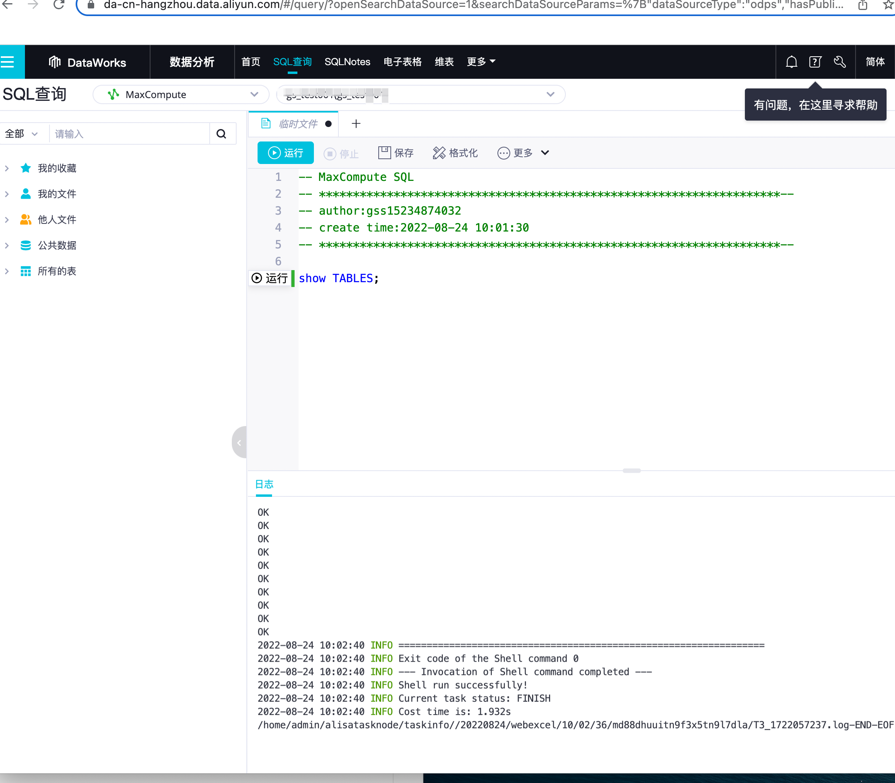

odps使用

<!-- more -->

##### 一、介绍

云原生大数据计算服务（MaxCompute，原名 ODPS）是一种快速、完全托管的TB/PB级数据仓库解决方案。MaxCompute向用户提供了完善的数据导入方案以及多种经典的分布式计算模型，能够更快速的解决用户海量数据计算问题，有效降低企业成本，并保障数据安全。

##### 官网

https://www.alibabacloud.com/help/zh/maxcompute/latest/maxcompute-maxcompute

##### 二、使用前提条件

- 已经开通对象存储OSS（Object Storage Service）服务。具体操作请参考[开通OSS服务](https://help.aliyun.com/document_detail/31884.html#task-njz-hf4-tdb)。
- 已经创建MaxCompute的项目空间。具体操作请参考[创建MaxCompute项目](https://help.aliyun.com/document_detail/27815.html#task-zl2-mtx-5db)

###### 1.开通DetaWorks


###### 2.开通**MaxCompute**


##### 三、创建项目demo（官网）

https://www.alibabacloud.com/help/zh/maxcompute/latest/create-a-maxcompute-project#section-zte-d8i-7im

###### 1.控制台查询工具



###### 2.使用客户端（odpscmd）连接

官网：

https://help.aliyun.com/document_detail/27971.html

配置：

```apl
project_name=空间名称
access_id=xxx
access_key=xxx
end_point=创建MaxCompute项目时选择的地域以及网络连接方式配置
```

###### 启动：

在系统的命令行执行窗口，进入MaxCompute客户端安装路径下的**bin**目录，执行`odpscmd`命令（Windows系统）或`sh odpscmd`（Linux系统或Mac系统），即可启动MaxCompute客户端。返回如下信息，表明已成功连接MaxCompute项目。


**退出**

q ｜quit

**进入项目空间**

use <project_name>

**查看项目空间属性**

setproject;

**查看所有表**

show tables;

**查看表信息**

**desc**  table；

