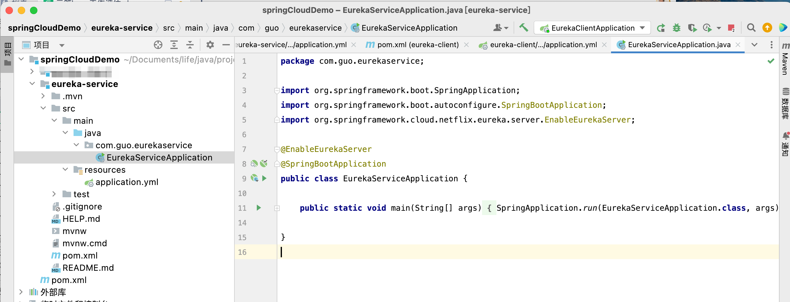
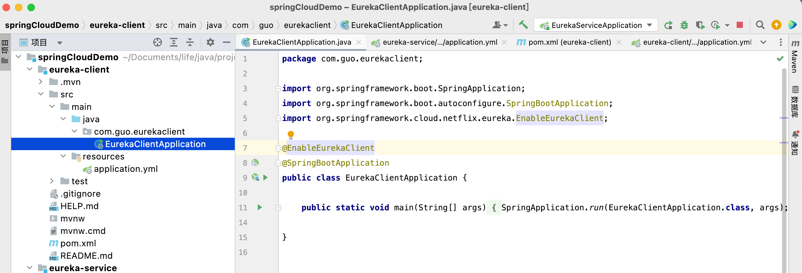

sspringCloudDemo原版
<!-- more -->

### spring cloud简介

Spring Cloud 被称为构建分布式微服务系统的“全家桶”，它并不是某一门技术，而是一系列微服务解决方案或框架的有序集合。它将市面上成熟的、经过验证的微服务框架整合起来，并通过 Spring Boot 的思想进行再封装，屏蔽调其中复杂的配置和实现原理，最终为开发人员提供了一套简单易懂、易部署和易维护的分布式系统开发工具包。

### 创建步骤

#### 1.创建主工程（Maven Project）

###### 创建一个maven项目删除src模块


#### 2.**Eureka注册服务** 

##### Eureka简介

Eureka 是 `Netflix` 开发的服务发现框架，SpringCloud 将它集成在自己的子项目spring-cloud-netflix 中，实现 SpringCloud 的服务发现功能。Eureka 包含两个组件：`Eureka Server 和 Eureka Client`。

##### Eureka Server简介

Eureka 服务注册中心，主要用于提供服务注册功能。当微服务启动时，会将自己的服务注册到 Eureka Server。Eureka Server 维护了一个可用服务列表，存储了所有注册到 Eureka Server 的可用服务的信息，这些可用服务可以在 Eureka Server 的管理界面中直观看到。

##### Eureka Server创建

###### 创建一个boot项目选择Eureka Server依赖



###### yml

```yaml
server:
  port: 8761

eureka:
  instance:
    hostname: localhost
  client:
    registerWithEureka: false
    fetchRegistry: false
    serviceUrl:
      defaultZone: http://${eureka.instance.hostname}:${server.port}/eureka/


```

节点：

`hostname`: localhost #eureka服务端的实例名称，

`register-with-eureka`: false #false表示不向注册中心注册自己。

`fetch-registry`: false #false表示自己端就是注册中心，我的职责就是维护服务实例，并不需要去检索服务

`defaultZone`:\#这里标注的是单机版服务注册中心

###### xml

```xml
<dependencies>
    <dependency>
        <groupId>org.springframework.cloud</groupId>
        <artifactId>spring-cloud-starter-netflix-eureka-server</artifactId>
    </dependency>

    <dependency>
        <groupId>org.springframework.boot</groupId>
        <artifactId>spring-boot-starter-test</artifactId>
        <scope>test</scope>
        <exclusions>
            <exclusion>
                <groupId>org.junit.vintage</groupId>
                <artifactId>junit-vintage-engine</artifactId>
            </exclusion>
        </exclusions>
    </dependency>
</dependencies>
```

###### 启动类

```java
@EnableEurekaServer
@SpringBootApplication
public class EurekaServiceApplication {

    public static void main(String[] args) {
        SpringApplication.run(EurekaServiceApplication.class, args);
    }

}
```

###### 启动：

Eureka Server是有页面的，启动后浏览器访问

当前无注册进来的服务


##### **Eureka Client简介**

Eureka 客户端，通常指的是微服务系统中各个微服务，主要用于和 Eureka Server 进行交互。在微服务应用启动后，Eureka Client 会向 Eureka Server 发送心跳（默认周期为 30 秒）。若 Eureka Server 在多个心跳周期内没有接收到某个 Eureka Client 的心跳，Eureka Server 将它从可用服务列表中移除（默认 90 秒）。 

###### 创建一个boot项目选择Eureka Client依赖



###### yml

```yaml
eureka:
  client:
    serviceUrl:
      defaultZone: http://localhost:8761/eureka/
server:
  port: 8762
spring:
  application:
    name: service-client
```

节点

`name`服务名称

`defaultZone`注册的服务地址，向这个地址注册

###### 启动类

```java
@EnableEurekaClient
@SpringBootApplication
public class EurekaClientApplication {

    public static void main(String[] args) {
        SpringApplication.run(EurekaClientApplication.class, args);
    }

}
```

启动后查看Eureka Server控制台

service-client服务已经注册到service


#### Eureka Server 集群

在微服务架构中，一个系统往往由十几甚至几十个服务组成，若将这些服务全部注册到同一个 Eureka Server 中，就极有可能导致 Eureka Server 因不堪重负而崩溃，最终导致整个系统瘫痪。解决这个问题最直接的办法就是部署 Eureka Server 集群。

我们知道，在 Eureka 实现服务注册与发现时一共涉及了 3 个角色：服务注册中心、服务提供者以及服务消费者，这三个角色分工明确，各司其职。但是其实在 Eureka 中，所有服务都既是服务消费者也是服务提供者，服务注册中心 Eureka Server 也不例外。

##### 示例：

参照localhost 的搭建过程，也就是搭建的第一个eureka-service。在主工程下另外再创建两个 Eureka Server：localhost2 和 localhost3，此时这 3 个 Eureka Server 无论是 Maven 依赖、代码还是配置都是一模一样的。

##### eureka-server2

###### yml配置

```yaml
server:
  port: 8751

eureka:
  instance:
    hostname: localhost2
  client:
    registerWithEureka: false
    fetchRegistry: false
    serviceUrl:
      defaultZone: http://${eureka.instance.hostname}:${server.port}/eureka/
```

##### eureka-server3

###### yml配置

```yaml
server:
  port: 8741

eureka:
  instance:
    hostname: localhost3
  client:
    registerWithEureka: false
    fetchRegistry: false
    serviceUrl:
      defaultZone: http://${eureka.instance.hostname}:${server.port}/eureka/
```
