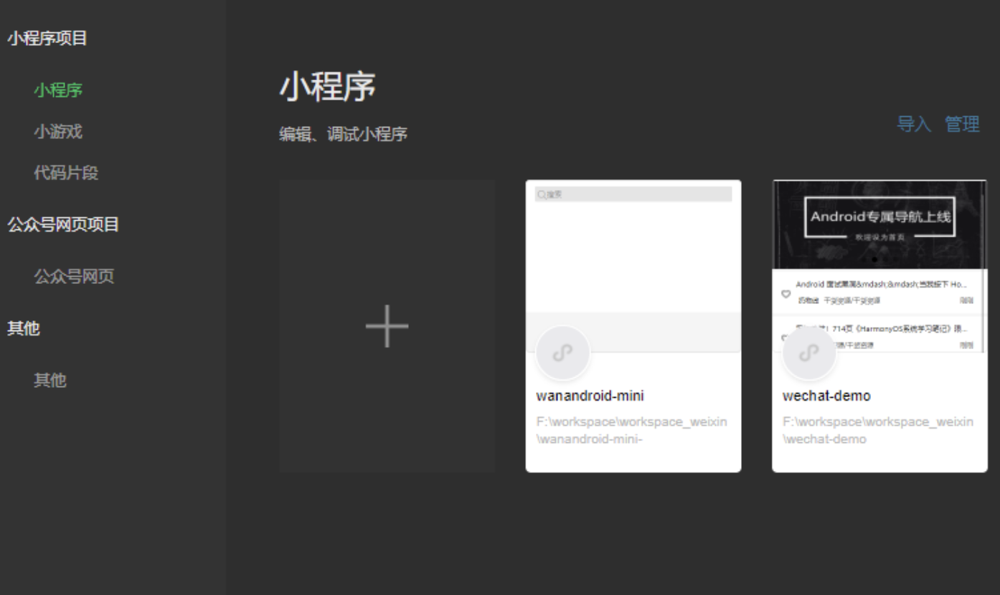

微信小程序开发
<!-- more -->

##### 小程序是什么

小程序可以视为只能用微信打开和浏览的网站。小程序和网页的技术模型是一样的，用到的 JavaScript 语言和 CSS 样式也是一样的，只是网页的 HTML 标签被修改成了 WXML 标签，CSS标签被修改成了WXSS标签。

小程序最大的优势就是基于微信，也不需要考虑iOS和Android不同平台间的差异，同时微信也提供了丰富的API接口，例如拍摄、录音、语音识别、二维码等，小程序可以利用原生能力，快速进行开发。

##### 开发准备

1. 去[微信公众平台](https://mp.weixin.qq.com/wxamp/home/guide?lang=zh_CN&token=1570180230)注册，申请一个AppId。
2. 下载小程序开发工具，[微信开发者工具](https://mp.weixin.qq.com/wxamp/thirdtools/extend?token=1570180230&lang=zh_CN)。

##### 创建一个项目

##### 调试运行项目

小程序支持实时预览，代码修改后，左边预览窗口就可以直接看到修改后的效果。

也可以点击预览按钮，通过微信的扫一扫在手机上体验。

##### 小程序项目机构

